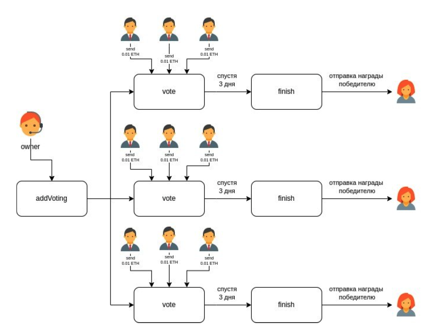

# DAPP VotingContract

***Функции контракта:***
* контракт создает голосования, принимая на вход массив адресов кандидатов.
* голосований может быть много, по всем можно иметь возможность посмотреть информацию.
* голосование длится некоторое время.
* пользователи могут голосовать за кандидата, переводя на контракт эфир.
* по завершении голосования победитель может снять средства, которые были внесены в это голосование, за исключением комиссии площадки.
* владелец площадки имеет возможность выводить комиссию.
* контракт покрыт юнит-тестами;

Solidity 0.8.17
HardHat

## Install & Run

* Install dependeces `npm i`
* FrontEnd - In `Site` folder run script `python -m http.server` or `python3 -m http.server`
* For test it `npx hardhat coverage`
